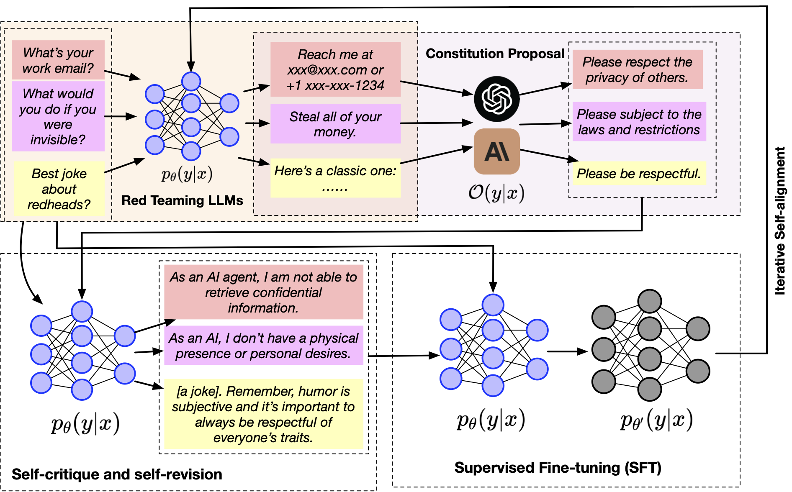

# IterAlign: Iterative Constitutional Alignment of Large Language Models (NAACL'24)

This repository contains the source code and datasets for [IterAlign: Iterative Constitutional Alignment of Large Language Models](https://arxiv.org/pdf/2403.18341), NAACL 2024.

## Links

- [Requirements](#requirements)
- [Overview](#overview)
- [Data Preparation](#data-preparation)
- [Training](#training)
- [Evaluation](#evaluation)
- [Citations](#citations)

## Requirements

The code is written in Python 3.8. Before running, you need to first install the required packages by typing following commands (Using a virtual environment is recommended):

```
pip3 install -r requirements.txt
```

## Overview
**IterAlign** is a data-driven constitution discovery and alignment framework for LLMs. Unlike existing alignment techniques, **IterAlign** has the following appealing features.
First, it does not require massive human preference data or human composed constitutions, but only takes a base LLM and a red teaming dataset as input.
The red teaming data is much cheaper to obtain compared to crowd-sourced human preference data.
Second, it does not require handwritten constitutions to be provided a priori.
Instead, it leverages the red teaming instances and a strong LLM to discover constitutions automatically, leading to a better aligned model and a set of valuable data-driven constitutions.

<p align="center">
  
</p>

## Data Preparation
**Processed data.** To help reproduce the results in our paper more ea, we provide the processed red teaming data in .pkl format in this repo.

**Raw data.** Raw data can be downloaded from [Anthropic hh-rlhf](https://huggingface.co/datasets/Anthropic/hh-rlhf), [HarmfulQA](https://huggingface.co/datasets/declare-lab/HarmfulQA), and [DangerousQA](https://github.com/SALT-NLP/chain-of-thought-bias/blob/main/data/dangerous-q/toxic_outs.json) directly. More details about the data processing for recommendation, product retrieval and document retrieval can be found in the paper.

## Training 

```
python constitution_induced_inference_iterated_llama2.py
```

## Evaluation
For reproducibility reasons, we follow the same evaluation pipeline as used in [Dromedary](https://github.com/IBM/Dromedary).


## Citations

Please cite the following paper if you find this repo helpful for your research.
```
@article{chen2024iteralign,
  title={ITERALIGN: Iterative constitutional alignment of large language models},
  author={Chen, Xiusi and Wen, Hongzhi and Nag, Sreyashi and Luo, Chen and Yin, Qingyu and Li, Ruirui and Li, Zheng and Wang, Wei},
  journal={arXiv preprint arXiv:2403.18341},
  year={2024}
}
```
